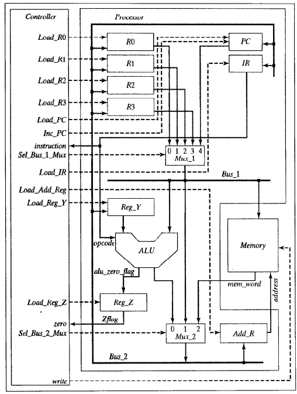

# 8-bit RISC CPU Core (Stored-Program Architecture)

## 📌 Overview
This repository contains the RTL design and verification of an 8-bit RISC micro-processor based on the Von Neumann (Stored-Program) architecture. The core is designed from scratch using Verilog and verified through rigorous simulation.

## 🏗️ System Architecture
The CPU operates on a multi-cycle Data Path and is governed by a Finite State Machine (FSM) Control Unit.

*(Kéo thả file ảnh Sơ đồ khối của bạn vào dòng dưới đây)*

**Key Modules:**
- **ALU (Arithmetic Logic Unit):** Supports core arithmetic (ADD, SUB) and logic (AND, NOT) operations.
- **Register File:** Includes 4 General Purpose Registers (R0 - R3), a Program Counter (PC), and an Instruction Register (IR).
- **Control Unit:** A multi-cycle FSM (Fetch -> Decode -> Execute cycles) designed to decode instructions and coordinate the datapath.
- **Memory Unit:** 256-byte synchronous single-port RAM utilized for both Instructions and Data.

## 💻 Instruction Set Architecture (ISA)
The CPU utilizes a custom 8-bit instruction format structured as: 
`[7:4] Opcode | [3:2] Source Register | [1:0] Destination Register`

| Opcode (Binary) | Mnemonic | Description |
| :--- | :--- | :--- |
| `0000` | **NOP** | No Operation |
| `0001` | **ADD** | Dest = Dest + Source |
| `0010` | **SUB** | Dest = Dest - Source |
| `0011` | **AND** | Bitwise AND |
| `0100` | **NOT** | Bitwise NOT |
| `0101` | **RD** | Read Data from Memory |
| `0110` | **WR** | Write Data to Memory |
| `0111` | **BR** | Unconditional Branch (Jump) |
| `1000` | **BRZ** | Branch if Zero (Z-flag = 1) |

## ⚙️ Tools & Technologies
- **Hardware Description Language:** Verilog 
- **Simulation & Verification:** QuestaSim / ModelSim

## 🔬 Verification & Simulation Results
The design has been verified by writing self-checking testbenches and analyzing the output waveforms to ensure timing constraints and logic accuracy are met.
## 🚀 How to Run
1. Clone this repository to your local machine.
2. Open QuestaSim/ModelSim and change the directory to the project folder.
3. Compile the `RISC_SPM.v` and the testbench file.
4. Run the simulation and add the relevant signals to the Wave window to observe the execution.
